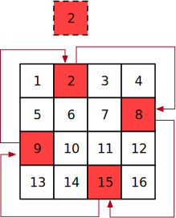

### [240. 搜索二维矩阵 II](https://leetcode-cn.com/problems/rotate-image/)

**题目：**
给定一个 `n × n` 的二维矩阵 `matrix` 表示一个图像。请你将图像顺时针旋转 90 度。

你必须在**原地**旋转图像，这意味着你需要直接修改输入的二维矩阵。请不要 使用另一个矩阵来旋转图像。

示例 1：

```
输入：matrix = [
  [1,2,3],
  [4,5,6],
  [7,8,9]
]
输出：[
  [7,4,1],
  [8,5,2],
  [9,6,3]
]
```

示例 2：

```
输入：matrix = [
  [5,1,9,11],
  [2,4,8,10],
  [13,3,6,7],
  [15,14,12,16]
]
输出：[
  [15,13,2,5],
  [14,3,4,1],
  [12,6,8,9],
  [16,7,10,11]
]
```

示例 3：

```
输入：matrix = [[1]]
输出：[[1]]
```

示例 4：

```
输入：matrix = [
  [1,2],
  [3,4]
]
输出：[
  [3,1],
  [4,2]
]
```

提示：

- `matrix.length == n`
- `matrix[i].length == n`
- `1 <= n <= 20`
- `-1000 <= matrix[i][j] <= 1000`

**题解一：原地旋转 1**

相同颜色代表四个互相交换的位置。



```js
/**
 * @param {number[][]} matrix
 * @return {void} Do not return anything, modify matrix in-place instead.
 */
var rotate = function (matrix) {
  let temp = 0;
  const n = matrix.length - 1;
  for (let i = 0; i <= Math.floor(n / 2); i++) {
    for (let j = i; j < n - i; j++) {
      // 比如：当前为 temp = 3 = matrix[0][2]
      temp = matrix[j][n - i];
      // 要旋转到 6 的位置，也就是 matrix[][]
      matrix[j][n - i] = matrix[i][j];
      matrix[i][j] = matrix[n - j][i];
      matrix[n - j][i] = matrix[n - i][n - j];
      matrix[n - i][n - j] = temp;
    }
  }
};
```

**题解二：原地旋转 2**

```js
/**
 * @param {number[][]} matrix
 * @return {void} Do not return anything, modify matrix in-place instead.
 */
var rotate = function (matrix) {
  let temp = 0;
  // 长度
  const len = matrix.length;
  // 下标
  const n = len - 1;
  for (let row = 0; row < Math.floor(len / 2); row++) {
    for (let col = 0; col < Math.floor((len + 1) / 2); col++) {
      // temp = arr[0][0]
      let tmp = matrix[row][col];
      matrix[row][col] = matrix[n - col][row];
      matrix[n - col][row] = matrix[n - row][n - col];
      matrix[n - row][n - col] = matrix[col][n - row];
      matrix[col][n - row] = tmp;
    }
  }
};
```

复杂度分析：

- 时间复杂度：O(n^2)，n 为 matrix 的边长。需要枚举的子矩阵大小为 ⌊n/2⌋×⌊(n+1)/2⌋)=O(n^2)。
- 空间复杂度：O(1)。为原地旋转。
