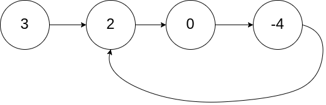
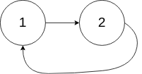
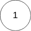

### [141. 环形链表](https://leetcode-cn.com/problems/linked-list-cycle/)

**题目：** 给定一个链表，判断链表中是否有环。

为了表示给定链表中的环，我们使用整数 pos 来表示链表尾连接到链表中的位置（索引从 0 开始）。 如果 `pos` 是 `-1`，则在该链表中没有环。

示例 1：

```
输入：head = [3,2,0,-4], pos = 1
输出：true
解释：链表中有一个环，其尾部连接到第二个节点。
```



示例  2：

```
输入：head = [1,2], pos = 0
输出：true
解释：链表中有一个环，其尾部连接到第一个节点。
```



示例 3：

```
输入：head = [1], pos = -1
输出：false
解释：链表中没有环。
```



进阶：

你能用 O(1)（即，常量）内存解决此问题吗？

**题解一：快慢指针**

设置快、慢两个指针：快指针一次走两步，慢指针一次走一步。遍历单链表，如果单链表中存在环，则快慢指针会相遇；否则快指针将会最先到达尾部（快指针指向 null）。

```js
/**
 * Definition for singly-linked list.
 * function ListNode(val) {
 *     this.val = val;
 *     this.next = null;
 * }
 */

/**
 * @param {ListNode} head
 * @return {boolean}
 */
var hasCycle = function (head) {
  if (!head || !head.next) {
    return false;
  }
  let slow = head;
  let fast = head.next;
  while (slow != fast) {
    if (fast == null || fast.next == null) {
      return false;
    }
    // 慢指针走一步
    slow = slow.next;
    // 快指针走两步
    fast = fast.next.next;
  }
  return true;
};
```

复杂度分析：

- 时间复杂度：O(n)
- 空间复杂度：O(1)

**题解二：设置标志**

遍历链表节点，每个已遍历过的节点加标志位（visited），当出现下一个节点已被标志时，则证明单链表有环；否则链表遍历完之后没有出现访问过的节点则说明链表没有环。

```js
let hasCycle = function (head) {
  while (head) {
    if (head.visited) {
      return true;
    }
    head.visited = true;
    head = head.next;
  }
  return false;
};
```

复杂度分析：

- 时间复杂度：O(n)
- 空间复杂度：O(n)

**题解三：哈希表**

使用 WeakMap 存储已访问过的节点，如果在后面的循环中再次出现存储在 WeakMap 中的节点，则说明链表有环；否则知道遍历完所有节点，没有出现储存过的节点则说明链表没有环。

```js
var hasCycle = function (head) {
  let map = new WeakMap();
  if (!head && !head.next) {
    return false;
  }
  while (head) {
    if (map.get(head)) {
      return true;
    } else {
      map.set(head, head);
      head = head.next;
    }
  }
  return false;
};
```

复杂度分析：

- 时间复杂度：O(n)
- 空间复杂度：O(n)

**题解四：JSON.stringify**

`JSON.stringify()` 不能序列化含有循环引用的结构。

```js
let hasCycle = function (head) {
  try {
    JSON.stringify(head);
    return false;
  } catch (err) {
    return true;
  }
};
```

复杂度分析：

- 时间复杂度：O(n)
- 空间复杂度：O(n)
