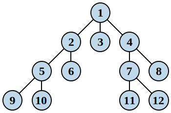

### [剑指 Offer 55 - I. 二叉树的深度](https://leetcode-cn.com/problems/er-cha-shu-de-shen-du-lcof/)

同 [104. 二叉树的最大深度](https://leetcode-cn.com/problems/maximum-depth-of-binary-tree/)

**题目：** 输入一棵二叉树的根节点，求该树的深度。从根节点到叶节点依次经过的节点（含根、叶节点）形成树的一条路径，最长路径的长度为树的深度。

例如：给定二叉树 [3,9,20,null,null,15,7]，

```
    3
   / \
  9  20
    /  \
   15   7
```

返回它的最大深度  3 。

考察点：树、深度优先搜索算法(DFS)  


**题解一：递归**  
树每个节点的深度与它左右子树的深度有关，且等于其左右子树最大深度 +1。

复杂度分析：

- 时间复杂度：我们每个结点只访问一次，因此时间复杂度为 O(n)，其中 N 是结点的数量。
- 空间复杂度：在最糟糕的情况下，树是完全不平衡的，例如每个结点只剩下左子结点，递归将会被调用 n 次（树的高度），因此保持调用栈的存储将是 O(n)。但在最好的情况下（树是完全平衡的），树的高度将是 log(n)。因此，在这种情况下的空间复杂度将是 O(log(n))。

```js
/**
 * Definition for a binary tree node.
 * function TreeNode(val) {
 *     this.val = val;
 *     this.left = this.right = null;
 * }
 */
/**
 * @param {TreeNode} root
 * @return {number}
 */
var maxDepth = function (root) {
  // 如果节点为 null，返回 0 层级不再增加
  if (root === null) {
    return 0;
  }
  // 否则左右子树层级大者 +1
  return Math.max(maxDepth(root.left), maxDepth(root.right)) + 1;
};
```

**题解二：迭代**  
递归转非递归，可以用栈来实现，递归转换为迭代。

- 不断边压栈边出栈
  - 先两边边开始分别都压一个
  - 并先返回一边 剩下的出栈就都是另一边 即一次只出栈一个节点即可实现
- 每次出栈取高度的最大值，初始化 root 根节点高度为 1 就不用再加 1 了
- 返回更新的高度最终确定比较值

复杂度分析：

- 时间复杂度：O(n)。
- 空间复杂度：O(n)。

```js
/**
 * Definition for a binary tree node.
 * function TreeNode(val) {
 *     this.val = val;
 *     this.left = this.right = null;
 * }
 */
/**
 * @param {TreeNode} root
 * @return {number}
 */
var maxDepth = function (root) {
  // 栈 {key: 节点, val: 深度}
  var tmpStack = [{ key: root, val: 1 }];
  // 深度
  var depth = 0;
  // 非空栈
  while (tmpStack.length != 0) {
    // 出栈：从栈中删除最后一个元素，并返回该元素的值
    var currObj = tmpStack.pop();
    // node
    var currNode = currObj.key;
    // node 不为 null
    if (currNode != null) {
      // 取出当前节点的深度
      var currNode_depth = currObj.val;
      // 取深度较大值
      depth = Math.max(depth, currNode_depth);
      // 压栈：更新深度 +1
      // Stack 先进后出(FILO)
      if (currNode.right != null) {
        tmpStack.push({ key: currNode.right, val: currNode_depth + 1 });
      }
      if (currNode.left != null) {
        tmpStack.push({ key: currNode.left, val: currNode_depth + 1 });
      }
    }
  }
  return depth;
};
```

**题解三：队列 BFS**

广度优先搜索算法遍历（BFS），从树的根节点开始从左到右，从上到下，一层一层往下遍历，用队列的数据结构配合实现(先进先出(FIFO))。



- 遍历二叉树节点，依次将当前节点 和它的左右子节点入队，并再一一出队
- 针对子节点的节点重复上一步操作
- 刚好符合"先进先出" => "先入队再出队"
- 数组：push -> shift

```js
/**
 * Definition for a binary tree node.
 * function TreeNode(val) {
 *     this.val = val;
 *     this.left = this.right = null;
 * }
 */
/**
 * @param {TreeNode} root
 * @return {number}
 */
var maxDepth = function (root) {
  if (root == null) {
    return 0;
  }
  // 队列
  var tmpQueue = [root];
  var result = [];
  var currNode = null;
  // 队列不为空
  while (tmpQueue.length != 0) {
    currNode = tmpQueue.shift();
    result.push(currNode);
    if (node.left != null) {
      tmpQueue.push(node.left);
    }
    if (node.right != null) {
      tmpQueue.push(node.right);
    }
  }
  return result;
};
```
