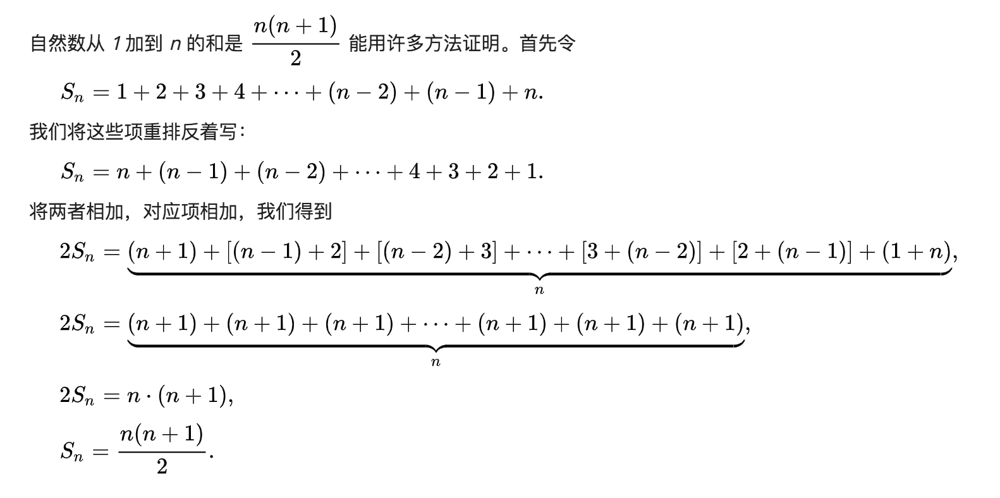

### [面试题 64. 求 1+2+…+n](https://leetcode-cn.com/problems/qiu-12n-lcof/)

**题目：** 求 1+2+...+n ，要求不能使用乘除法、for、while、if、else、switch、case 等关键字及条件判断语句（A?B:C）。

示例 1：

```
输入: n = 3
输出: 6
```

示例 2：

```
输入: n = 9
输出: 45
```

限制：`1 <= n <= 10000`

**题解一：递归**

递归 `n + n - 1 + n -2 + ... + 3 + 2 + 1`

```js
/**
 * @param {number} n
 * @return {number}
 */
var sumNums = function(n) {
  // n + n - 1 + n - 2
  if (n <= 1) {
    return n;
  }
  let sum = n;
  sum += sumNums(n - 1);
  return sum;
};
```

**题解二：等差数列求和公式**



```js
/**
 * @param {number} n
 * @return {number}
 */
var sumNums = function(n) {
  return (n * (n + 1)) / 2;
};
```
