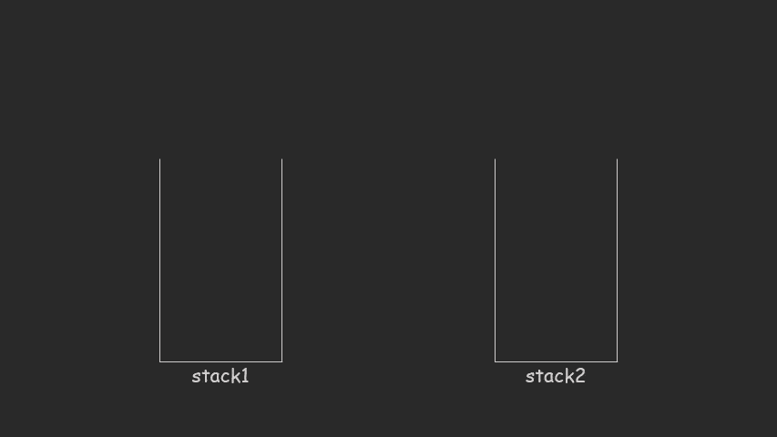

### [剑指 Offer 09. 用两个栈实现队列](https://leetcode-cn.com/problems/yong-liang-ge-zhan-shi-xian-dui-lie-lcof/)

**题目：** 用两个栈实现一个队列。队列的声明如下，请实现它的两个函数 `appendTail` 和 `deleteHead`，分别完成在队列尾部插入整数和在队列头部删除整数的功能。(若队列中没有元素，`deleteHead` 操作返回 -1)

示例 1：

```
输入：
["CQueue","appendTail","deleteHead","deleteHead"]
[[],[3],[],[]]
输出：[null,null,3,-1]
```

示例 2：

```
输入：
["CQueue","deleteHead","appendTail","appendTail","deleteHead","deleteHead"]
[[],[],[5],[2],[],[]]
输出：[null,-1,null,null,5,2]
```

提示：

- `1 <= values <= 10000`
- `最多会对 appendTail、deleteHead 进行 10000 次调用`

**题解：**



```ts
class CQueue {
  constructor() {}
  // 声明两个栈 stack1 和 stack2
  // 其中 stack1 支持插入操作，stack2 支持删除操作
  stack1: number[] = [];
  stack2: number[] = [];

  appendTail(value: number): void {
    // 新元素加到栈顶
    this.stack1.push(value);
  }

  deleteHead(): number {
    // 1. 如果 stack2 为空，则将 stack1 里的所有元素弹出插入到 stack2 里
    // 2. 如果 stack2 仍为空，则返回 -1，否则从 stack2 弹出一个元素并返回
    // 若 stack2 长度小于 1
    if (!this.stack2.length) {
      // 将 stack1 中的元素从栈顶依次弹出（后进先出），并将弹出的元素压入 stack2 栈
      while (this.stack1.length) {
        this.stack2.push(this.stack1.pop() as number);
      }
    }
    // 若 stack2 栈中元素大于等于 1，则弹出（后进先出）
    if (this.stack2.length) {
      return this.stack2.pop() as number;
    }
    return -1;
  }
}

/**
 * Your CQueue object will be instantiated and called as such:
 * var obj = new CQueue()
 * obj.appendTail(value)
 * var param_2 = obj.deleteHead()
 */
```

复杂度分析：

- 时间复杂度：对于插入和删除操作，时间复杂度均为 O(1)。插入不多说，对于删除操作，虽然看起来是 O(n) 的时间复杂度，但是仔细考虑下每个元素只会「至多被插入和弹出 stack2 一次」，因此均摊下来每个元素被删除的时间复杂度仍为 O(1)。

- 空间复杂度：O(n)。需要使用两个栈存储已有的元素。
