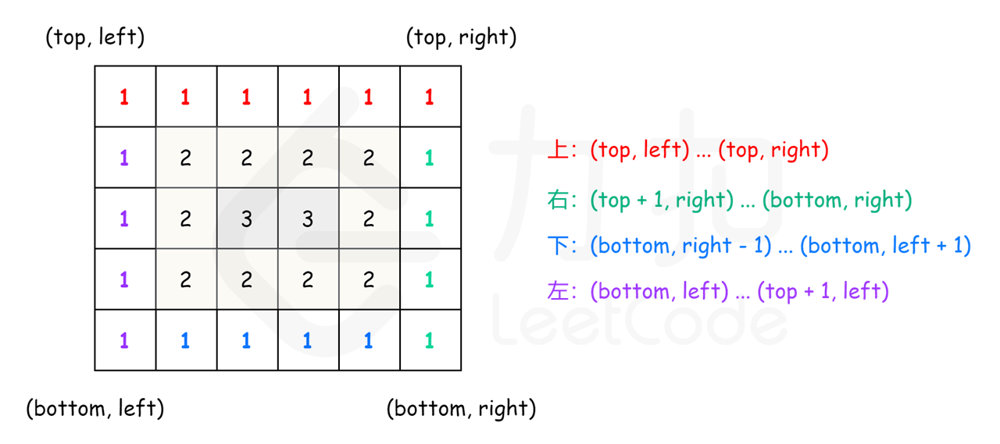

### [剑指 Offer 29. 顺时针打印矩阵](https://leetcode-cn.com/problems/shun-shi-zhen-da-yin-ju-zhen-lcof/)

同 [54. 螺旋矩阵](https://leetcode-cn.com/problems/spiral-matrix/)

**题目：** 输入一个矩阵，按照从外向里以顺时针的顺序依次打印出每一个数字。

示例 1：

```
输入：matrix = [[1,2,3],[4,5,6],[7,8,9]]
输出：[1,2,3,6,9,8,7,4,5]
```

示例 2：

```
输入：matrix = [[1,2,3,4],[5,6,7,8],[9,10,11,12]]
输出：[1,2,3,4,8,12,11,10,9,5,6,7]
```

限制：

- `0 <= matrix.length <= 100`
- `0 <= matrix[i].length <= 100`

**题解：按层模拟**

可以将矩阵看成若干层，首先打印最外层的元素，其次打印次外层的元素，直到打印最内层的元素。

定义矩阵的第 _k_ 层是到最近边界距离为 _k_ 的所有顶点。例如，下图矩阵最外层元素都是第 _1_ 层，次外层元素都是第 _2_ 层，剩下的元素都是第 _3_ 层。

```
[[1, 1, 1, 1, 1, 1, 1],
 [1, 2, 2, 2, 2, 2, 1],
 [1, 2, 3, 3, 3, 2, 1],
 [1, 2, 2, 2, 2, 2, 1],
 [1, 1, 1, 1, 1, 1, 1]]
```

对于每层，从左上方开始以顺时针的顺序遍历所有元素。假设当前层的左上角位于 (_top_, _left_)，右下角位于 (_bottom_,_right_)，按照如下顺序遍历当前层的元素。

1. 从左到右遍历上侧元素，依次为 (_top_, _left_) 到 (_top_, _right_)。
2. 从上到下遍历右侧元素，依次为 (_top_ + 1, _right_) 到 (_bottom_, _right_)。
3. 如果 _left_ < _right_ 且 _top_ < _bottom_，则从右到左遍历下侧元素，依次为 (_bottom_, _right_ − 1) 到 (_bottom_, _left_ + 1)，以及从下到上遍历左侧元素，依次为 (_bottom_, _left_) 到 (_top_ + 1, _left_)。

遍历完当前层的元素之后，将 _left_ 和 _top_ 分别增加 1，将 _right_ 和 _bottom_ 分别减少 1，进入下一层继续遍历，直到遍历完所有元素为止。



```js
/**
 * @param {number[][]} matrix
 * @return {number[]}
 */
var spiralOrder = function (matrix) {
  // [
  //     [1, 2, 3, 4],
  //     [5, 6, 7, 8],
  //     [9, 10, 11, 12]
  // ]
  if (matrix.length === 0 || matrix[0].length === 0) {
    return [];
  }
  // 行、列
  let rows = matrix.length,
    columns = matrix[0].length;
  let order = [];
  // 下标
  let index = 0;
  // 上边界 top : 0
  // 下边界 bottom : matrix.length - 1
  // 左边界 left : 0
  // 右边界 right : matrix[0].length - 1
  let left = 0,
    right = columns - 1,
    top = 0,
    bottom = rows - 1;
  // 遍历完成条件
  while (left <= right && top <= bottom) {
    // 左到右遍历上侧元素
    for (let column = left; column <= right; column++) {
      order[index++] = matrix[top][column];
    }
    // 从上到下遍历右侧元素
    for (let row = top + 1; row <= bottom; row++) {
      order[index++] = matrix[row][right];
    }
    if (left < right && top < bottom) {
      // 从右到左遍历下侧元素
      for (let column = right - 1; column > left; column--) {
        order[index++] = matrix[bottom][column];
      }
      //   从下到上遍历左侧元素
      for (let row = bottom; row > top; row--) {
        order[index++] = matrix[row][left];
      }
    }
    // 遍历完当前层的元素之后，将 left、top 增加 1，将 right、bottom_减少 1
    left++;
    right--;
    top++;
    bottom--;
  }
  return order;
};
```

**复杂度分析：**

- 时间复杂度：O(mn)，其中 m 和 n 分别是输入矩阵的行数和列数。矩阵中的每个元素都要被访问一次。
- 空间复杂度：O(1)。除了输出数组以外，空间复杂度是常数。
